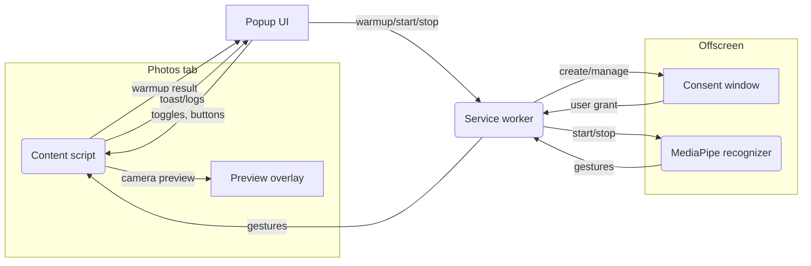

# Fingertips Chrome Extension

Gesture-driven helper that streamlines navigation and deletion inside [iCloud Photos](https://www.icloud.com/photos/).

## Features (current build)
- Popup toggle to enable/disable the on-page camera preview.
- Camera warmup button in the popup to request access and show the preview inside iCloud Photos.
- Under-the-hood pieces for gesture-driven navigation remain in the repo, but gesture dispatch is currently disabled while we stabilise camera behaviour.

## Project Layout
```
manifest.json
background.js
shared/          # shared constants + chrome.storage helpers
content/         # injected scripts (preview overlay only)
offscreen/       # gesture recognizer scaffolding (idle for now)
popup/           # popup UI (HTML/CSS/JS)
models/          # gesture_recognizer.task (copied from hotos)
consent/         # visible camera-permission window
libs/            # MediaPipe Tasks vision runtime (copied in locally)
```

## MediaPipe runtime assets
MediaPipe files are not committed, but they must exist in `libs/` before packaging the extension. After `npm install`, copy the vision bundle locally:

```bash
mkdir -p libs/wasm
cp node_modules/@mediapipe/tasks-vision/vision_bundle.mjs libs/tasks-vision.esm.js
cp node_modules/@mediapipe/tasks-vision/wasm/vision_wasm_internal.* libs/wasm/
cp node_modules/@mediapipe/tasks-vision/wasm/vision_wasm_nosimd_internal.* libs/wasm/
```

The offscreen recognizer loads `libs/tasks-vision.esm.js` and the accompanying WASM via `chrome.runtime.getURL`, so they need to be present when you zip the extension for the Chrome Web Store.

## Loading the extension
1. Copy the `gesture_recognizer.task` model from the `hotos` repo into `models/` (already done in this workspace).
2. Load the unpacked directory in Chrome (`chrome://extensions` → *Developer mode* → *Load unpacked*).
3. Navigate to `https://www.icloud.com/photos/`, open the extension popup, toggle **Enable camera preview**, and click **Request camera**. Chrome will prompt for camera access the first time we call `getUserMedia`; approve it so the overlay can appear.
4. Use **Grant camera permission** if the warmup keeps reporting a permission denial—this opens a visible prompt window so Chrome can show the extension-level request. After granting, the popup automatically warms up the gesture engine and you can toggle **Start/Stop gesture engine** to exercise the recognizer without live actions.
5. After the prompt is accepted, the preview overlay appears in the bottom-right corner.

## Gesture mappings & repeat tuning
Open the popup to remap gestures (left column) to extension actions. Repeat delay/interval defaults live in `shared/constants.js` and are persisted in `chrome.storage.local` as part of the extension state. Adjustments can be added to the popup later if desired.

## Delete flow notes
- The first delete uses the native toolbar so the background service worker can capture the full CloudKit endpoint + payload template.
- Subsequent deletes call `records/modify` directly with the stored template and the current asset metadata (record name + change tag taken from the Photos React fiber tree). If metadata is unavailable, the script falls back to the UI path.
- After successful direct deletes, the script nudges the UI (arrow-right in OneUp, DOM cleanup in grid view) to keep navigation smooth while Photos receives CloudKit updates.
- Gesture recognition is temporarily disabled; the offscreen document remains in the codebase for future reactivation once camera handling is solid.

## Development tips
- To inspect asset metadata resolution, enable Chrome DevTools on the iCloud tab and watch console logs prefixed with `Fingertips`.
- Camera preview sizing/position lives in `content/main.js`; tweak the CSS there if you want a different overlay style.

## Architecture

### High-level flow



### Component responsibilities

- **Content script (`content/main.js`)**
  - Handles the live preview (`getUserMedia` in page origin).
  - Relays warmup/start/stop commands from the popup to the service worker.
  - Logs gesture debug info once per second (no actions yet).

- **Service worker (`background.js`)**
  - Manages extension state in `chrome.storage`.
  - Controls the offscreen document lifecycle (warmup/start/stop).
  - Owns the camera consent window and forwards gesture events to active tabs.

- **Offscreen document (`offscreen/gesture.js`)**
  - Runs the MediaPipe recognizer at ~10 Hz on its own `getUserMedia` stream.
  - Emits continuous gesture payloads back to the service worker.

- **Camera consent window (`consent/consent.html/js`)**
  - Visible tab-capture workaround so the extension origin can prompt for camera permission.

- **Popup (`popup/popup.*`)**
  - Provides buttons for each incremental block: preview toggle, camera warmup, start/stop recognizer, and camera consent.
  - Displays status for every action so debugging is straightforward.
